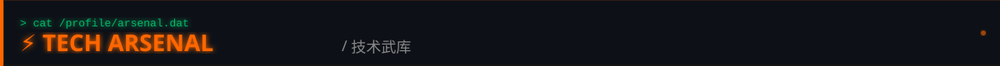

<!-- ═══════════ HEADER ═══════════ -->

 
 

<a href="https://git.io/typing-svg">

    </td>
  </tr>
</table>

 

<!-- ═══════════ RESEARCH

 
 

<i>"Exploring the intersection of multiple modalities — building systems that see, read, and understand."</i>
 
<i>「TECH ARSENAL ═══════════ -->

<a href="https://skillicons.dev">
  

<!-- ═══════════ auto-ssh) | SSH automation utility / 
 

 
 

 

<!-- ═══════════ CONTRIBUTION ARCADE ═══════════ -->

 
 

<picture>
  <source mediathub.com/spinner-bot">
  
</a>

 
 

