  

  

  

  

---

<table>
  <tr>
    <td width="50%" valign="top">

## 🎮 Character Sheet / 角色面板

| Attribute / 属性 | Value / 值 |
|---|---|
| **Callsign / 代号** | spinner-bot / 浪兮 |
| **Identity / 本名** | Zhang Ruihan / 张锐寒 |
| **Spawn Point / 坐标** | Nanjing, Jiangsu, China / 中国·江苏·南京 |
| **Class / 职业** | AI Undergraduate / 人工智能本科生 |
| **Faction / 阵营** | HHU · AI &amp; Automation / 河海大学·人工智能与自动化学院 |
| **Guild / 公会** | DIG Lab — 数智治域实验室 (2025 URT) |
| **Current Mode / 状态** | Learning · Building · Shipping / 学习 · 构建 · 交付 |
| **Contact / 联络** | [GitHub](https://github.com/spinner-bot) |

    </td>
    <td width="50%" valign="top">

## 🎯 Active Quests / 当前任务

| Quest / 任务 | Progress / 进度 |
|---|---|
| 🔬 Multimodal OPD Research / 多模态 OPD 研究 | `████████░░` 80% |
| 🧠 AI &amp; Deep Learning / AI 与深度学习 | `██████░░░░` 60% |
| ☕ Learning Java / 学习 Java | `██░░░░░░░░` 20% |
| 🛠 Building useful tools / 打造实用工具 | `██████████` ONGOING |
| 🎮 Game Development / 游戏开发 | `██████░░░░` 60% |

    </td>
  </tr>
</table>

---

## 🔬 Research Focus / 研究方向

  
  
  
  

  <i>"Exploring the intersection of multiple modalities — building systems that see, read, and understand."</i>
   
  <i>「探索多模态的交汇点——构建能看、能读、能理解的系统。」</i>

---

## ⚡ Tech Arsenal / 技术武库

  

| Slot / 插槽 | Loadout / 装备 |
|---|---|
| **Languages / 语言** |     |
| **AI / ML** |     |
| **Tools / 工具** |     |
| **Current Focus / 专注** |     |

---

## 🚀 Featured Projects / 精选项目

| Project / 项目 | Description / 描述 | Stack |
|---|---|---|
| 🏙️ [**Concept-UrbanChain**](https://github.com/spinner-bot/Concept-UrbanChain) | Concept system exploring advanced algorithms for urban computing / 城市计算概念系统与算法实验 | `Python` |
| 🧠 [**AI-lab-2nd-gen**](https://github.com/spinner-bot/AI-lab-2nd-generation) | NLP, CV &amp; cutting-edge AI learning codes and notes / NLP、CV 与前沿 AI 学习代码和笔记 | `Python` |
| 🎮 [**Pixel-Roamer**](https://github.com/spinner-bot/Pixel-Roamer) | A game I designed 10 years ago — finally brought to life / 10年前设计的游戏，终于实现 | `Python` |
| 🌌 [**IllusionaryNook**](https://github.com/spinner-bot/IllusionaryNook) | 3D open-world sandbox with extreme freedom / 3D开放世界沙盒，极高自由度 | `C++` |
| 🔮 [**sphere-dreamweave**](https://github.com/spinner-bot/sphere-dreamweave) | Explore the beauty of mathematics through code / 在代码世界中探索数学之美 | `C++` |
| 🧩 [**mind-map**](https://github.com/spinner-bot/mind-map) | Auto-generate .mind files from your thoughts / 自动扫描思维生成思维导图 | `C` |
| ⚡ [**EffiLife**](https://github.com/spinner-bot/EffiLife) | Efficiency &amp; productivity tools / 浪兮效率，高效生活 | `Python` |
| 🔗 [**auto-ssh**](https://github.com/spinner-bot/auto-ssh) | SSH automation utility / SSH 自动化工具 | `Python` |

---

## 📊 Stats Console / 统计面板

  
  
   
   
  
   
   
  

---

## 🕹️ Contribution Arcade / 贡献街机

  

  <picture>
    <source media="(prefers-color-scheme: dark)" srcset="https://raw.githubusercontent.com/spinner-bot/spinner-bot/output/github-contribution-grid-snake-dark.svg" />
    <source media="(prefers-color-scheme: light)" srcset="https://raw.githubusercontent.com/spinner-bot/spinner-bot/output/github-contribution-grid-snake.svg" />
    
  </picture>

---

## 📡 Connect / 联络

  
  
  

  

